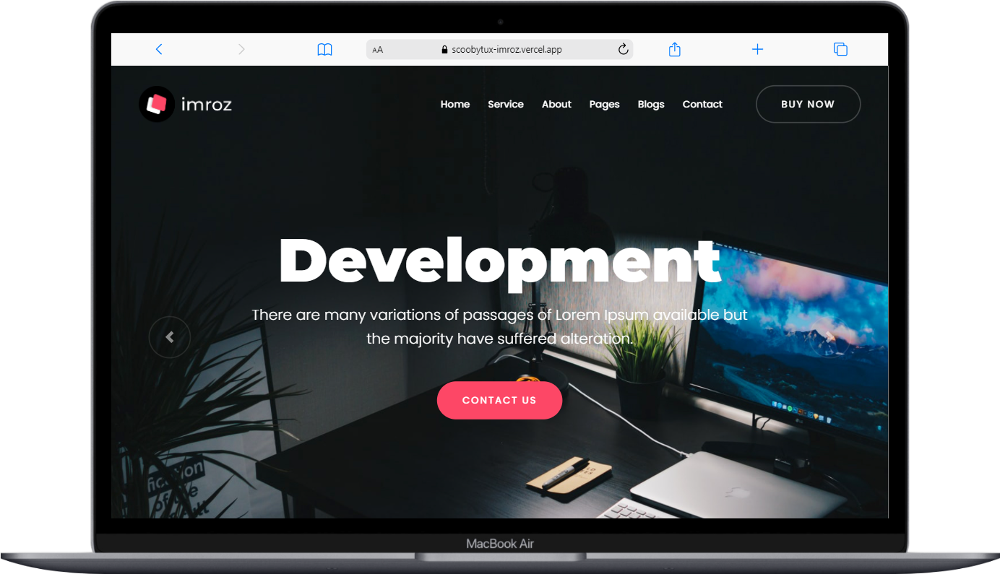
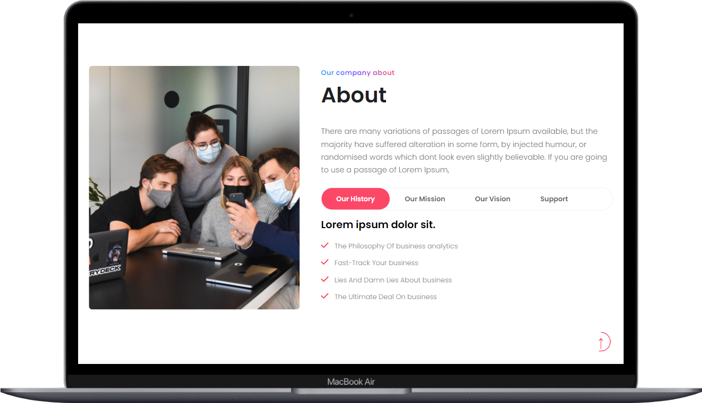
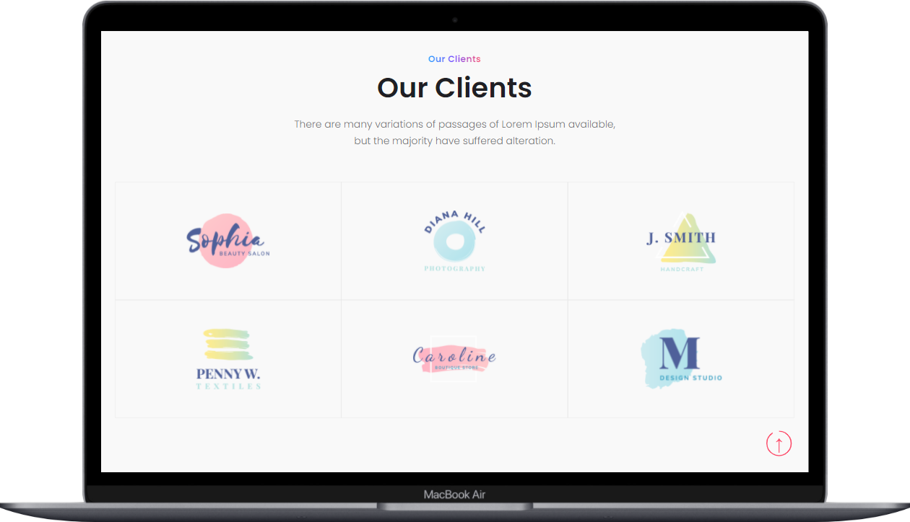
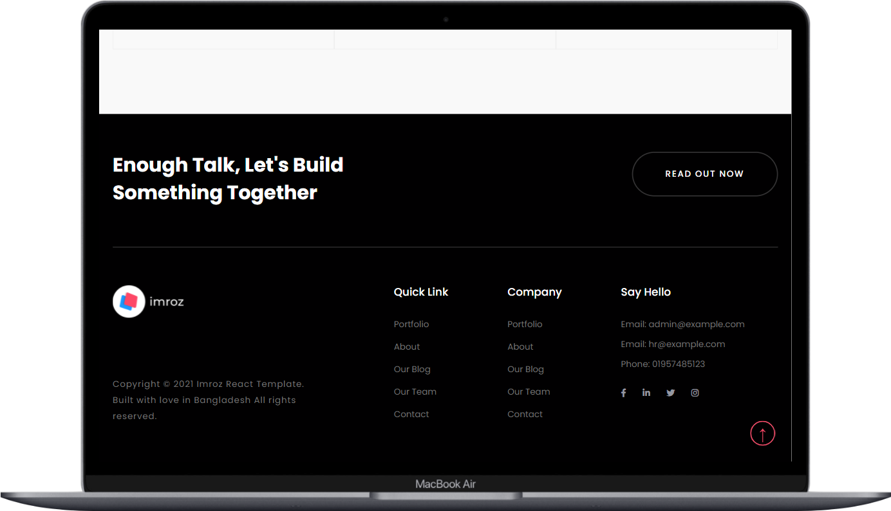
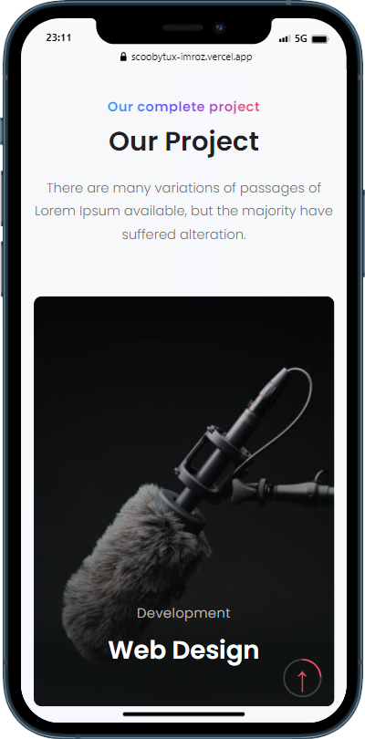
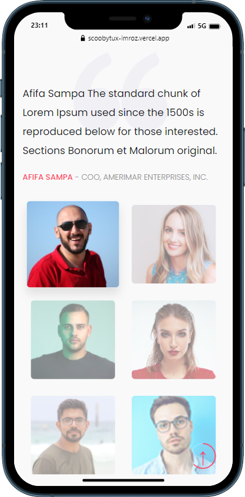
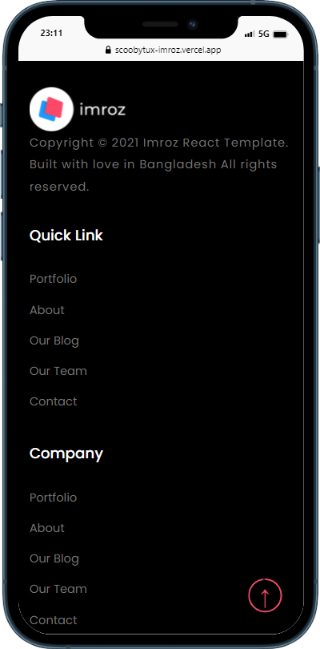

# Imroz Homepage Layout

See the live page [Imroz](https://scoobytux-imroz.vercel.app "Imroz") 👓

## Introduction

A webpage layout built with HTML5, CSS3, Bootstrap 4 and Sass.

## Tasks and Roadmap

### Phase 1: Responsive web design and effects

> Feb 24 - Mar 2, 2022

- [x] Homepage layout with responsive web design on different devices (desktop, laptop, mobile, ...)
- [x] Full effects

### Phase 2: Refactor

- [ ] Refactor source code

## Project Structure

```
$PROJECT_ROOT
│   # Resource files
├── assets
│   │   # Image files
│   ├── images
│   │   # JavaScript files
│   ├── js
│   │   # Scss files
│   ├── scss
│   │   # CSS files
│   └── styles
│   # Screenshots of the project
├── screenshots
│   # Page content
└── index.html
```

### Installation and Run

Check out the webpage -> [Imroz](https://scoobytux-imroz.vercel.app "Imroz") or run locally:

- `git clone https://github.com/scoobytux/imroz.git`
- `cd imroz`
- Open `index.html` file

## Some Project's Views on Devices

- MacBook/ Laptop views









- Mobile views







## Credits and Reference

| Resource                                                               | Description          |
| ---------------------------------------------------------------------- | -------------------- |
| [http://rainbowit.net/html/imroz/digital-agency.html][original layout] | The original website |

[original layout]: http://rainbowit.net/html/imroz/digital-agency.html
